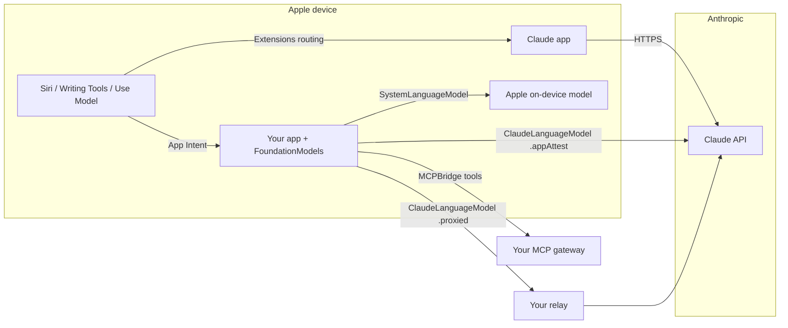

# Claude in Apple Intelligence

Lab for putting Claude behind Apple Intelligence on iPhone, iPad, and Mac, with the
guardrails an identity-security team needs before it ships to a fleet.

There are two separate integration surfaces. They are often conflated in press
coverage, so this lab keeps them apart:

| Surface | Who configures it | What it does | OS floor |
|---|---|---|---|
| **Apple Intelligence Extensions** | End user (or MDM policy) | Siri, Writing Tools, Visual Intelligence, and the Shortcuts *Use Model* action route to the Claude app instead of Apple's model | iOS 27 / iPadOS 27 / macOS 27 |
| **Foundation Models provider** | App developer | Your own app calls Claude through Apple's `LanguageModelSession` API via the `ClaudeForFoundationModels` Swift package | iOS 27 / macOS 27 / visionOS 27 / watchOS 27 |

On iOS 26 neither exists. The only bridge is the Claude app's **Ask Claude** App
Intent driven from Shortcuts or Siri, documented in the fallback guide.

If the goal is for Siri to reach **your own tools** rather than the consumer Claude
app, neither surface above does it directly. The path is your app's App Intent,
which runs a model with tools discovered at runtime from your MCP gateway. That is
`docs/05-mcp-gateway-bridge.md` and the `MCPBridge` target.

## Contents

| Path | Purpose |
|---|---|
| `docs/01-enable-claude-extension.md` | User-side enablement on iOS 27 and macOS 27, feature by feature |
| `docs/02-shortcuts-ios26.md` | Fallback for iOS 26 devices using the Ask Claude App Intent and Shortcuts |
| `docs/03-mdm-guardrails.md` | Restriction keys, data-flow analysis, and the allow/deny decision matrix |
| `docs/04-in-app-foundation-models.md` | Developer integration with `ClaudeForFoundationModels`, auth modes, routing policy |
| `docs/05-mcp-gateway-bridge.md` | Siri to your own MCP gateway: App Intent, runtime tool discovery, tool policy |
| `docs/06-typing-surfaces.md` | Asking by typing, on device only: keyboard extension, Spotlight, and the context budget |
| `mdm/` | Ready-to-sign configuration profiles for the deny and allow postures |
| `swift/` | Swift package: `MCPBridge` (MCP tools as Foundation Models tools), `OnDeviceAssistant` (on-device only, context budgeting, typed intent), `IdentityAssistant` (Claude, routing, Siri intent) |
| `keyboard/` | Keyboard extension controller: ask a question inline and replace it with the answer |
| `relay/` | Zero-dependency Node relay for the `.proxied` auth mode and a local MCP gateway stub, with tests |

## Architecture

Apple is not in the request path for either surface. Extensions traffic goes from
the Claude app to Anthropic under the user's Claude account. Foundation Models
traffic goes from your app to Anthropic under your organization's workspace.
Private Cloud Compute is not involved. That distinction drives every guardrail in
`docs/03-mdm-guardrails.md`.

## Guardrails in one screen

- **Supervised corporate devices:** ship `mdm/deny-external-intelligence.mobileconfig`
  until an approved AI-use policy exists. Extensions honor the same restriction key
  that governed the ChatGPT integration, so the deny posture is available today.
- **BYOD and user-enrolled devices:** restrictions do not apply. Control the data,
  not the device. Keep regulated identity data out of apps that have Writing Tools
  access, and use App Protection style controls in the apps you own.
- **Apps you build:** never bundle an API key. Use `.appAttest` for direct-to-Anthropic
  or `.proxied` through the relay in this lab, which pins the model allowlist server-side.
- **Data classification before model choice:** the Swift package's `ModelRouter`
  sends prompts carrying identity PII to Apple's on-device model and everything
  else to Claude. Policy is code, not a checkbox.

## Status of the platform

Apple Intelligence Extensions and the server-side Foundation Models provider API
were announced at WWDC 2026 and ship with the OS 27 releases. Anthropic's package is
published as a beta at `0.1.0`. Menu labels in the Settings app have varied across
beta builds, so the enablement guide gives the screen path and the verification
steps rather than claiming exact toggle wording. Re-verify on your target build.

## Sources

- Anthropic, Claude for Foundation Models docs:
  <https://platform.claude.com/docs/en/cli-sdks-libraries/libraries/apple-foundation-models>
- Anthropic, `ClaudeForFoundationModels` package: <https://github.com/anthropics/ClaudeForFoundationModels>
- Apple, WWDC26 session 339, Bring an LLM provider to the Foundation Models framework:
  <https://developer.apple.com/videos/play/wwdc2026/339/>
- Apple, WWDC26 Apple Intelligence guide: <https://developer.apple.com/wwdc26/guides/apple-intelligence/>
- Apple, device management restrictions reference:
  <https://developer.apple.com/documentation/devicemanagement/restrictions>
- Anthropic, Claude App Intents, Shortcuts, and widgets on iOS:
  <https://support.claude.com/en/articles/10263469-use-claude-app-intents-shortcuts-and-widgets-on-ios>
