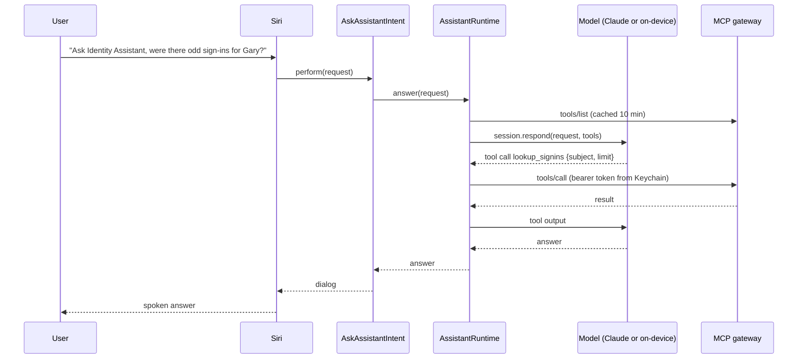

# Connect Apple Intelligence to your MCP gateway

Goal: Siri and Apple Intelligence can use whatever tools your MCP gateway exposes,
under your identity, with your policy deciding what runs.

## What Apple actually lets you plug in

There is no public API for registering your own service as an Apple Intelligence
Extension provider. WWDC26 session 339 covers how a model provider conforms to the
Foundation Models protocol, and says nothing about how an app registers as a
Siri or Writing Tools provider; the Extensions list in Settings is populated by
partner apps through the App Store marketplace. So "Apple Intelligence talks to my
gateway" has to be built one layer down, inside an app you control:

| Layer | What you control | Reaches your MCP gateway |
|---|---|---|
| Siri phrase | `AppShortcut` in your app | Yes, via your App Intent |
| App Intent | `AskAssistantIntent` in this lab | Yes |
| Model | Claude via `ClaudeForFoundationModels`, or Apple's on-device model | Both can call the same tools |
| Tools | `MCPBridge` converts `tools/list` into Foundation Models tools at runtime | Yes |
| Shortcuts *Use Model* action | Apple's action; its tools are other Shortcuts actions | Only through App Intents you expose as actions |
| Claude app as Extension | Anthropic's app | Not through your gateway. The Claude app's own connectors are not part of the Extensions path as documented |

The practical shape is therefore: **Siri → your App Intent → LanguageModelSession
with MCP-backed tools → your gateway**. Siri does the speech and phrase matching.
Your app owns the model, the credentials, and the policy.



## Components in this lab

| Component | File | Role |
|---|---|---|
| `MCPClient` | `swift/Sources/MCPBridge/MCPClient.swift` | Streamable HTTP client: initialize handshake, `Mcp-Session-Id`, JSON or SSE bodies, re-initialize on 404, `tools/list` pagination, `tools/call` |
| `SchemaBridge` | `swift/Sources/MCPBridge/SchemaBridge.swift` | JSON Schema `inputSchema` to `DynamicGenerationSchema`, so the model generates valid arguments |
| `MCPTool` | `swift/Sources/MCPBridge/MCPTool.swift` | One Foundation Models `Tool` per gateway tool. Arguments type is `GeneratedContent`, forwarded as JSON |
| `MCPToolPolicy` | `swift/Sources/MCPBridge/MCPToolPolicy.swift` | Allow and deny lists; confirmation gate for non-read-only tools; default denies |
| `KeychainTokenProvider` | `swift/Sources/MCPBridge/KeychainTokenProvider.swift` | Reads the gateway bearer token from the Keychain; your sign-in flow writes it |
| `AssistantRuntime` | `swift/Sources/IdentityAssistant/AssistantRuntime.swift` | Process-wide actor: gateway client, tool cache, routed session per request |
| `AskAssistantIntent` | `swift/Sources/IdentityAssistant/AskAssistantIntent.swift` | The App Intent Siri invokes |
| Gateway stub | `relay/mcp-gateway-stub.mjs` | Local test double with one read-only and one destructive tool |

`MCPBridge` has no dependency on Anthropic's package. It works with Apple's
on-device model too; that is what the routing policy falls back to.

## Wire it up

1. **Add the package** to your app. Import `IdentityAssistant` (or only `MCPBridge`
   if you are bringing your own model setup).
2. **Register the intents** from your app's `AppIntentsPackage` and add an
   `AppShortcutsProvider` in the app target. The snippet is in the header comment of
   `AskAssistantIntent.swift`. Phrases must include your app name; Siri matches on it.
3. **Configure the runtime at launch**:

```swift
import IdentityAssistant
import MCPBridge

let tokens = KeychainTokenProvider(service: "com.example.assistant")

await AssistantRuntime.shared.configure(.init(
    claude: ClaudeConfiguration(auth: .appAttest(clientID: "clid_...")),
    gateway: MCPGatewayConfiguration(
        endpoint: URL(string: "https://mcp.example.com/mcp")!,
        tokenProvider: tokens
    ),
    routing: .restricted,
    tools: MCPToolPolicy(
        deniedTools: ["delete_user"],
        confirmation: { tool, args in await ConfirmationSheet.present(tool: tool, argumentsJSON: args) }
    )
))
```

4. **Sign in to the gateway.** Run your OAuth flow (`ASWebAuthenticationSession`
   against the IdP that fronts the gateway), then `try tokens.store(accessToken)`.
   The client reads the Keychain on every request, so a refreshed token takes effect
   immediately. Return `nil` from the provider to make the client send no
   `Authorization` header.
5. **Test with Siri.** "Ask *AppName* were there any odd sign-ins for Gary this
   morning." Siri fills the `request` parameter, runs the intent, and speaks the
   result.

## Policy is the product

The three controls, in the order they apply:

1. **Routing** (`RoutingPolicy`): a request that contains identity PII stays on
   Apple's on-device model under `.restricted`. The same MCP tools are available
   there, so the gateway is still reachable, but the prompt never leaves the device.
   Apple's on-device model has a small context window; keep the exposed tool count
   under roughly ten or the schemas alone will exhaust it.
2. **Exposure** (`MCPToolPolicy.allowedTools` and `deniedTools`): what the model can
   see at all. Prefer an allowlist for a Siri-facing surface.
3. **Execution** (`MCPToolPolicy.confirmation`): any tool the server did not mark
   `readOnlyHint: true` goes through the confirmation handler first. The default
   handler denies, so an unconfigured app can only read. Your handler can show a
   sheet, or, inside an intent, use the App Intents confirmation API.

Two rules the bridge enforces on the gateway's behalf, because a gateway cannot see
who is holding the phone:

- The per-user bearer token is the only credential. The app never holds a gateway
  service key. Authorization for each tool call is the gateway's job, keyed to that
  token's subject.
- Tool results are data. They are returned to the model as text; the bridge does not
  execute anything in them.

## Test locally

Start the stub gateway and point the app at it:

```sh
cd relay
MCP_STUB_TOKEN=dev node mcp-gateway-stub.mjs
```

Configure the app with `endpoint: http://127.0.0.1:8788/mcp` and
`StaticTokenProvider("dev")`. App Transport Security blocks plain HTTP by default;
add a local-networking exception for development only.

Expected behaviour:

- "Show recent sign-ins for a@example.com" calls `lookup_signins` without a prompt.
- "Revoke all of a@example.com's sessions" reaches the confirmation handler. With the
  default policy the tool is not executed and the model reports that it was not
  approved.

The stub's own tests: `node --test` in `relay/`.

## Extending the gateway side

The bridge speaks plain MCP, so anything behind the gateway is available: your IdP's
audit API, a SIEM query tool, a ticketing system. Mark every tool with accurate
annotations; the policy depends on them. Give destructive tools an
`idempotentHint` where true, so a retry after a Siri timeout does not double-apply.
